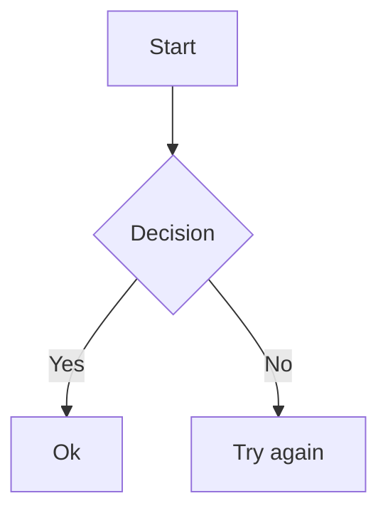

# PolyMark-Language-Pack-Mermaid

Standalone companion package for [PolyMark](https://thepolymodframework.carrd.co/).
Adds language-specific highlighting to PolyMark fenced code blocks tagged
`mermaid` or `mmd` by embedding the `source.mermaid` syntax of the community
[Mermaid](https://packagecontrol.io/packages/Mermaid) package.

## Dependencies

- The [Mermaid](https://packagecontrol.io/packages/Mermaid) package
  (install it from Package Control). It provides the `source.mermaid` syntax
  that this companion embeds. Without it, `mermaid`/`mmd` blocks still render
  as plain code blocks (PolyMark's raw fallback).

## Install

1. Install the Mermaid package via Package Control.
2. Copy the `PolyMark-Language-Pack-Mermaid` folder into your `Packages`
   directory next to `PolyMark`, then restart Sublime Text. No PolyMark edits
   are needed — PolyMark detects this package automatically.

## License

MIT. See `LICENSE`.
